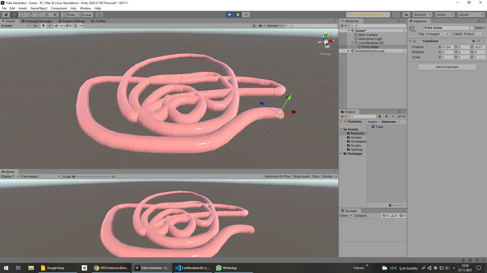
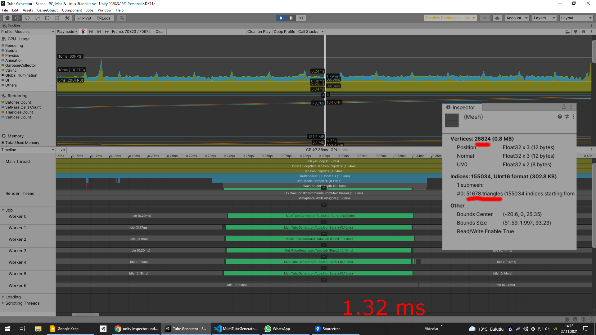

# LineRenderer3D-Multithreading
LineRenderer3D/Pipe/Tube Generator (Multithreading/Job System/Burst Compiler)

Çalışmakla birlikte tam olarak bitmemiş bir projem diyebilirim.
Job System ile geliştirdiğim için çok yüksek performans alabilirsiniz. Tabi performansı daha da artırabilir.
İlerleyen zamanlar performansı artırmak ve yeni özellikler eklemek istiyorum.

------------------------------------------------------------------------

I can say that it is an unfinished project, although I am working on it.
You can get very high performance because I write it with Job System. 
Of course, it can improve performance even more.
In the future, i want to improve performance and add new features.

21K vertices only 1.32ms
